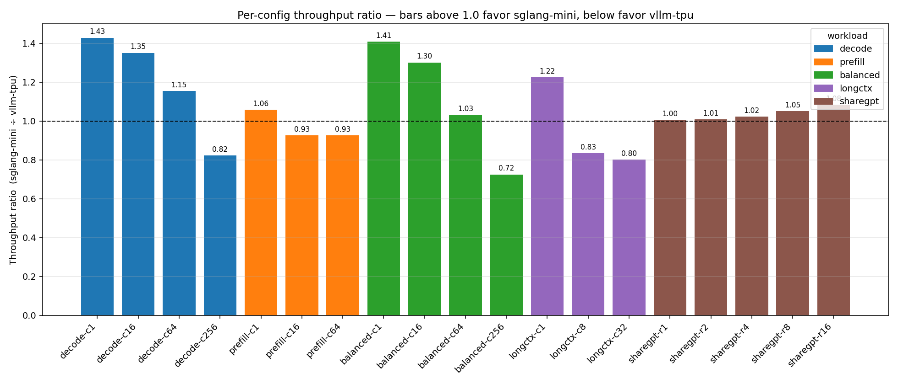
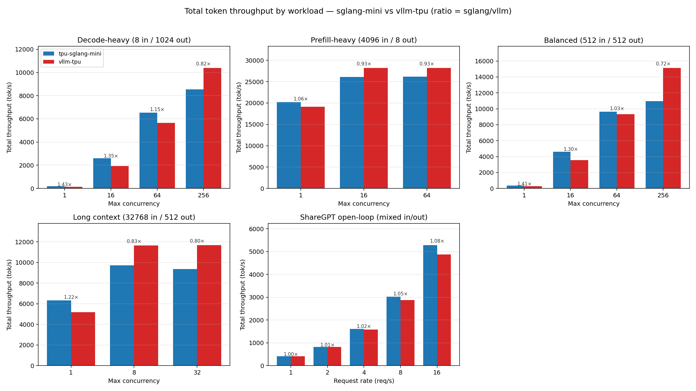
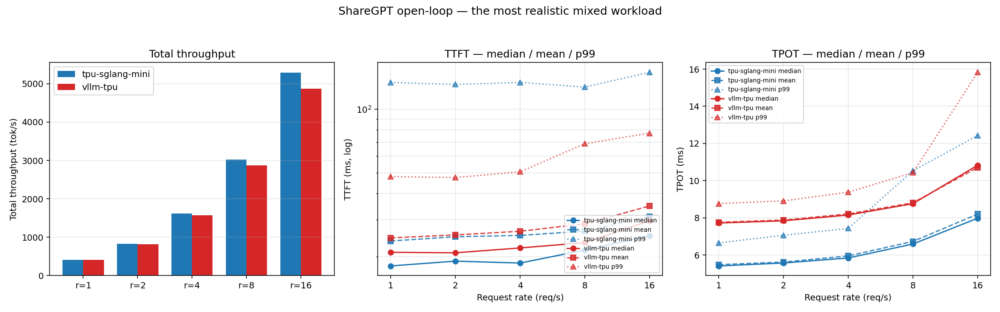
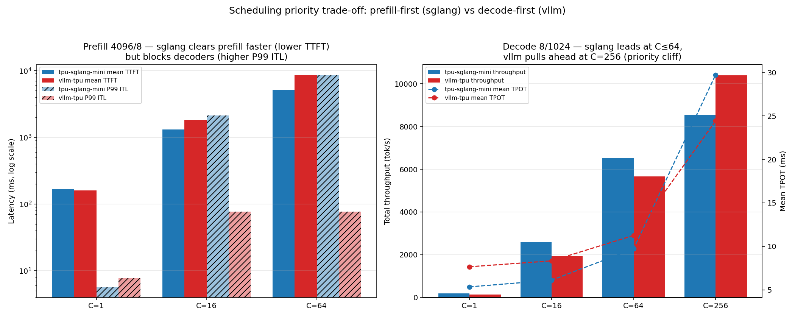
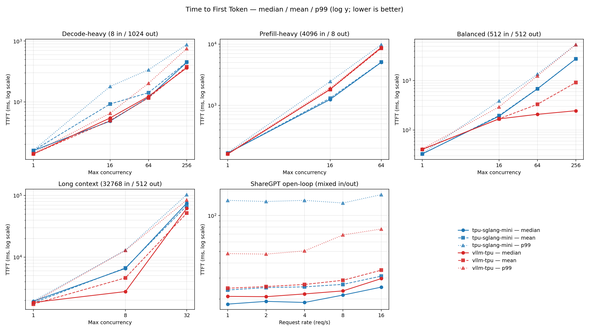
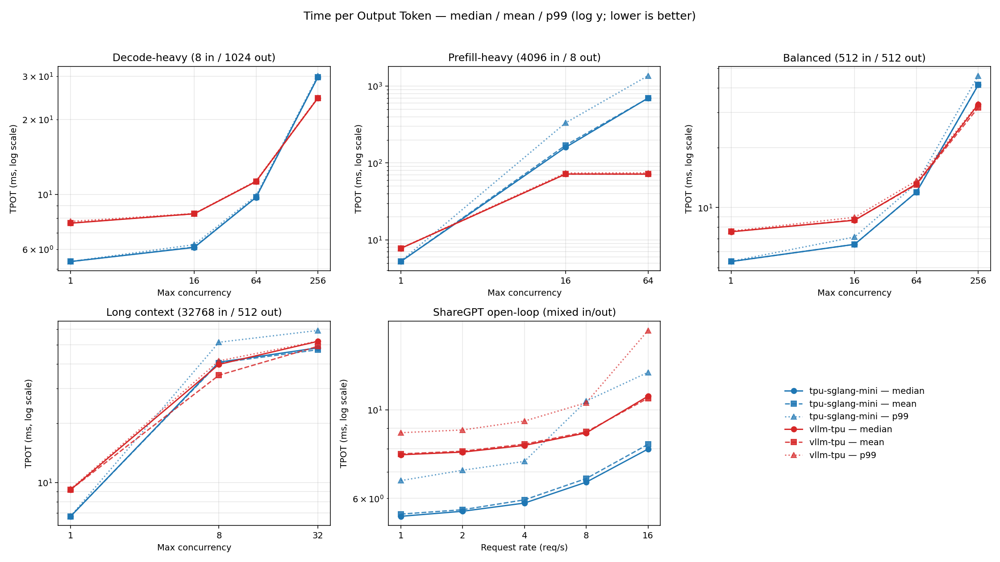
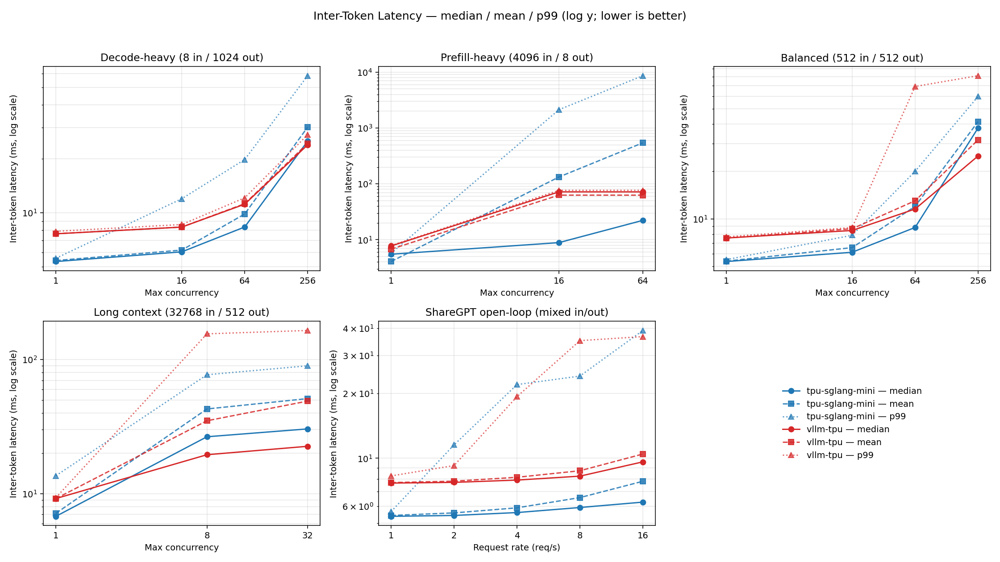

# `tpu-sglang-mini` vs `vllm-tpu` — Performance Parity Analysis

> Benchmark date: **2026-05-14** · Model: **Llama-3.1-8B-Instruct**, TP=4 · vLLM `0.13.3` (`vllm-tpu==0.13.3`) · 19 configs × 2 servers.
> Raw per-config serving-bench output lives in [`2026-05-14-tpu-bench.md`](benchmark/2026-05-14-tpu-bench.md). Charts are reproducible with `charts/plot_charts.py`.

## TL;DR

`tpu-sglang-mini` and `vllm-tpu` deliver **broadly comparable end-to-end performance** across a wide matrix of decode-heavy, prefill-heavy, balanced, long-context, and ShareGPT workloads. On the most realistic mixed workload (ShareGPT open-loop), they are within **0–8 %** on throughput; latency tracks the scheduling-priority split below — sglang is faster on median TPOT, vllm is faster on P99 TTFT. The places where the two diverge are not "one is faster than the other" — they are direct, predictable consequences of the **two servers' opposite scheduling priorities**:

* `tpu-sglang-mini` **prioritizes prefill**: new requests reach first-token quickly, but in-flight decoders can be starved when prefill demand spikes. This mimics the behavior of SGLang.
* `vllm-tpu` **prioritizes decode**: in-flight tokens stream at a steady, predictable rate, but newly-arrived requests wait longer for first token under load.

This difference accounts for every performance difference, from sglang's ~30 % per-token decode advantage at low concurrency to vllm's advantage at C=256 and its 113× better P99 inter-token latency under heavy prefill. Note that `tpu-sglang-mini` does not implement mixed prefill/decode, which could alleviate some of the most extreme drawbacks of prioritizing prefill.

*The dashed line at 1.0 marks parity. Bars above favor sglang-mini, below favor vllm-tpu. The ShareGPT bars on the right cluster tightly around 1.0 — that's the regime closest to real serving traffic.*

---

## Table of contents

1. [Methodology recap](#methodology-recap)
2. [Headline: total throughput across the matrix](#headline-total-throughput-across-the-matrix)
3. [Scheduling priority trade-off](#scheduling-priority-trade-off)
4. [Latency (TTFT, TPOT, ITL)](#latency-ttft-tpot-itl)
5. [Per-workload analysis](#per-workload-analysis)
   - [ShareGPT open-loop (realistic workload)](#sharegpt-open-loop-realistic-workload)
   - [Balanced (512 in / 512 out)](#balanced-512-in--512-out)
   - [Decode-heavy (8 in / 1024 out)](#decode-heavy-8-in--1024-out)
   - [Prefill-heavy (4096 in / 8 out)](#prefill-heavy-4096-in--8-out)
   - [Long context (32768 in / 512 out)](#long-context-32768-in--512-out)

---

## Methodology recap

The full protocol is in [`2026-05-14-tpu-bench.md`](benchmark/2026-05-14-tpu-bench.md); a compressed summary:

* **Single host, single TPU pod, TP=4**, port 30000, identical model and tokenizer for both servers.
* **Strict alternation**: each row launches one server, waits for `Application startup complete`, sends a 1-token warm-up to flush any remaining JIT, runs `vllm bench serve`, tears down the server group, then repeats for the other server. No cross-talk between runs.
* **Synthetic closed-loop** workloads pin `--max-concurrency` and use `--ignore-eos` so request count is deterministic. Output-length is the controlled variable.
* **ShareGPT open-loop** runs send 200 prompts at fixed `--request-rate` with no concurrency cap and no `--ignore-eos` — the realistic case where prompts and outputs come from the dataset distribution.
* **Server sizing**: both servers get `max-num-seqs / max-num-batched-requests = max(256, C)`. `tpu-sglang-mini` uses vLLM's default `--max-num-batched-tokens` for v5e (512), page-size 128 or 256 to match vLLM.

The 19-row matrix sweeps four axes — input length, output length, concurrency, and open-loop arrival rate — so we can isolate prefill vs decode effects rather than only seeing aggregate behavior.

---

## Headline: total throughput across the matrix

Numbers above each bar pair are the **sglang/vllm ratio**. Reading the figure left-to-right, top-to-bottom:

| Workload | What it stresses | sglang vs vllm |
|---|---|---|
| **Decode-heavy** | Token generation pipeline | sglang wins C=1,16,64 by 15–43 %; vllm wins C=256 by ~22 % |
| **Prefill-heavy** | Prompt processing throughput | All three concurrencies effective ties (within 8 %) |
| **Balanced** | Equal mix | sglang wins C=1, C=16 by 30–41 %; C=64 effective tie; vllm wins C=256 by 38 % |
| **Long context** | Prompt processing + long decode | sglang wins C=1; vllm wins C=8, C=32 by ~20–25 % |
| **ShareGPT** | Realistic mixed traffic | Within 0–8 % at every arrival rate (sglang slightly ahead) |

Neither server is uniformly faster, and on the most realistic configuration both stay tightly clustered.

ShareGPT uses variable input/output lengths from real conversations, with Poisson arrivals at a fixed rate, no concurrency cap, and no `--ignore-eos`.

---

## Scheduling priority trade-off

* **`tpu-sglang-mini` prioritizes prefill.** New prompts always make it to first-token before in-flight decoders get their next step. This keeps TTFT low, but creates latency spikes in decode while a large prompt prefills.
* **`vllm-tpu` prioritizes decode.** Decoders never have to wait for prefill, maintaining consistent per-token latency at the cost of TTFT for new requests.

This explains the performance differences between the two engines:

**Left panel — prefill workload (4096 in / 8 out):**

- Mean TTFT *(solid bars)*: sglang-mini is lower at C=16 (1.3 s vs 1.8 s) and C=64 (5.1 s vs 8.5 s). Prefill-first means new prompts reach first-token faster.
- P99 inter-token latency *(hatched bars)*: vllm-tpu stays flat at ~76 ms. sglang-mini blows up to **2.1 s at C=16** (28× higher) and **8.6 s at C=64** (113× higher) — prefill batches are preempting decode.

**Right panel — decode workload (8 in / 1024 out):**

- Bars (throughput): sglang-mini leads at C=1, 16, 64, then drops below vllm-tpu at C=256.
- Dashed lines (mean TPOT): sglang's per-token latency is consistently lower (5–10 ms vs 8–11 ms) up to C=64, then **crosses vllm-tpu's line at C=256** — this is explained as prefill churn at high concurrency disrupting decode.

---

## Latency (TTFT, TPOT, ITL)

We measure three latencies. Each chart shows **median (solid), mean (dashed), and P99 (dotted)** for both servers, with workload-specific subplots. Y-axes are log-scale to keep extreme tails legible.

### Time to First Token (TTFT)

* **Decode-heavy, balanced, long-context**: TTFT is dominated by prefill cost of the new prompt — small differences, both servers track each other.
* **Prefill-heavy**: sglang's prefill-first scheduler shows up as **lower** median/mean TTFT than vllm at C=16, C=64 — but the P99 curve climbs sharply for sglang (9.8 s at C=64 vs 8.9 s for vllm), because once a prefill batch is in flight it locks out the next one.
* **ShareGPT**: this is the one place where sglang's P99 TTFT is *worse* than vllm's (~130 ms vs 50–80 ms across rates).

### Time per Output Token (TPOT)

* **Decode-heavy and balanced at C ≤ 64**: sglang-mini's TPOT median/mean/P99 sit ~25–30 % below vllm-tpu at C=1 and C=16, narrowing to 8–14 % at C=64. Tight bands (median ≈ mean ≈ P99) for both servers.
* **Prefill-heavy C=16 and C=64**: vllm-tpu stays flat at ~72 ms. sglang's mean balloons to 170 ms (C=16) and **696 ms (C=64)** with a P99 of 1.4 s. The median *stays small* because most tokens stream fine — it's a small fraction of tokens that get blocked behind incoming prefills that yank the mean and P99 way up.
* **ShareGPT**: sglang is ~30–40 % faster on median and mean TPOT at every rate, and faster on P99 at every rate except r=8 where the two effectively tie (10.53 vs 10.43 ms).

### Inter-Token Latency (ITL)

ITL is the most user-perceptible streaming-latency metric and the clearest exhibit of the priority trade-off:

* **Prefill workload**: vllm-tpu P99 ITL stays at ~76 ms at C=16/64, while sglang's P99 climbs to 8.6 s at C=64. That's the **single most extreme number in the entire benchmark** and the strongest cost of the prefill-first policy.
* **Decode workload**: tight bands for both servers, sglang 20–40 % lower at C ≤ 64; at C=256 the two tie on median ITL but vllm-tpu wins P99 by ~2× (27.3 ms vs 58.3 ms).
* **ShareGPT**: sglang's P99 ITL climbs from 5.7 ms (r=1) to 39 ms (r=16) with bursty prefills mixed in; vllm-tpu rises more smoothly from 8.3 ms to 37 ms.

---

## Per-workload analysis

All charts are reported with numbers for tpu-mini-sglang first. We mark comparisons as a tie if the numbers are within 10% of one another.

### ShareGPT open-loop (realistic workload)

| Rate | Total tok/s (s vs v) | Median TTFT (ms) | Median TPOT (ms) | P99 TTFT (ms) | P99 ITL (ms) |
|---:|---|---|---|---|---|
| 1 | 416.2 vs 414.2 (tie) | **18.1** vs 21.0 | **5.41** vs 7.72 | 134 vs **48** | **5.66** vs 8.28 |
| 2 | 824.1 vs 817.0 (tie) | 19.1 vs 20.9 | **5.57** vs 7.84 | 131 vs **48** | 11.53 vs **9.25** |
| 4 | 1613.5 vs 1577.7 (tie) | **18.7** vs 22.0 | **5.84** vs 8.15 | 134 vs **51** | 21.95 vs **19.29** |
| 8 | 3023.4 vs 2876.8 (tie) | 21.5 vs 23.4 | **6.59** vs 8.76 | 127 vs **69** | **24.04** vs 35.09 |
| 16 | 5285.3 vs 4875.7 (tie) | **25.1** vs 29.6 | **7.98** vs 10.83 | 150 vs **77** | 39.11 vs 36.63 |

### Balanced (512 in / 512 out)

| C | Total tok/s (s vs v) | Mean TPOT (ms) | Mean TTFT (ms) | P99 ITL (ms) |
|---:|---|---|---|---|
| 1 | **368.9** vs 261.8 (sglang +41 %) | **5.36** vs 7.57 | 32.55 vs **40.20** | **5.51** vs 7.69 |
| 16 | **4624.5** vs 3553.1 (sglang +30 %) | **6.54** vs 8.67 | 195.95 vs **168.72** | **7.87** vs 8.81 |
| 64 | 9624.1 vs 9322.3 (tie) | 11.95 vs 13.05 | 689.50 vs **332.23** | **20.03** vs 69.25 |
| 256 | 10963.2 vs **15132.0** (vllm +38 %) | 41.28 vs **31.79** | 2773 vs **918** | **59.81** vs 81.07 |

### Decode-heavy (8 in / 1024 out)

| C | Total tok/s (s vs v) | Mean TPOT (ms) | Mean TTFT (ms) | P99 ITL (ms) |
|---:|---|---|---|---|
| 1 | **187.8** vs 131.4 (sglang +43 %) | **5.35** vs 7.66 | 15.75 vs **13.89** | **5.58** vs 7.89 |
| 16 | **2594.7** vs 1921.3 (sglang +35 %) | **6.12** vs 8.34 | 92.15 vs **49.28** | 11.99 vs **8.61** |
| 64 | **6538.4** vs 5662.2 (sglang +15 %) | **9.72** vs 11.26 | 141.28 vs **116.17** | 19.85 vs **12.13** |
| 256 | 8548.6 vs **10394.2** (vllm +22 %) | 29.72 vs **24.43** | 451.34 vs **379.25** | 58.27 vs **27.30** |

### Prefill-heavy (4096 in / 8 out)

| C | Total tok/s (s vs v) | Mean TTFT (ms) | Mean TPOT (ms) | P99 ITL (ms) |
|---:|---|---|---|---|
| 1 | 20207.6 vs 19091.3 (tie) | 166 vs 161 | **5.22** vs 7.75 | **5.73** vs 7.86 |
| 16 | 26124.9 vs 28207.1 (tie) | **1309** vs 1813 | 170 vs **71.9** | 2126 vs **76.6** |
| 64 | 26145.1 vs 28219.7 (tie) | **5073** vs 8544 | 696 vs **71.8** | 8639 vs **76.6** |

### Long context (32768 in / 512 out)

| C | Total tok/s (s vs v) | Mean TPOT (ms) | Mean TTFT (ms) | P99 ITL (ms) |
|---:|---|---|---|---|
| 1 | **6335.2** vs 5173.0 (sglang +22 %) | **6.74** vs 9.21 | 1808 vs 1729 | 13.61 vs **9.35** |
| 8 | 9712.0 vs **11638.7** (vllm +20 %) | 40.47 vs **35.04** | 6691 vs **4609** | **77.07** vs 155.54 |
| 32 | 9355.1 vs **11673.2** (vllm +25 %) | 47.19 vs 49.11 (≈) | 68412 vs **51854** | **89.86** vs 164.79 |
